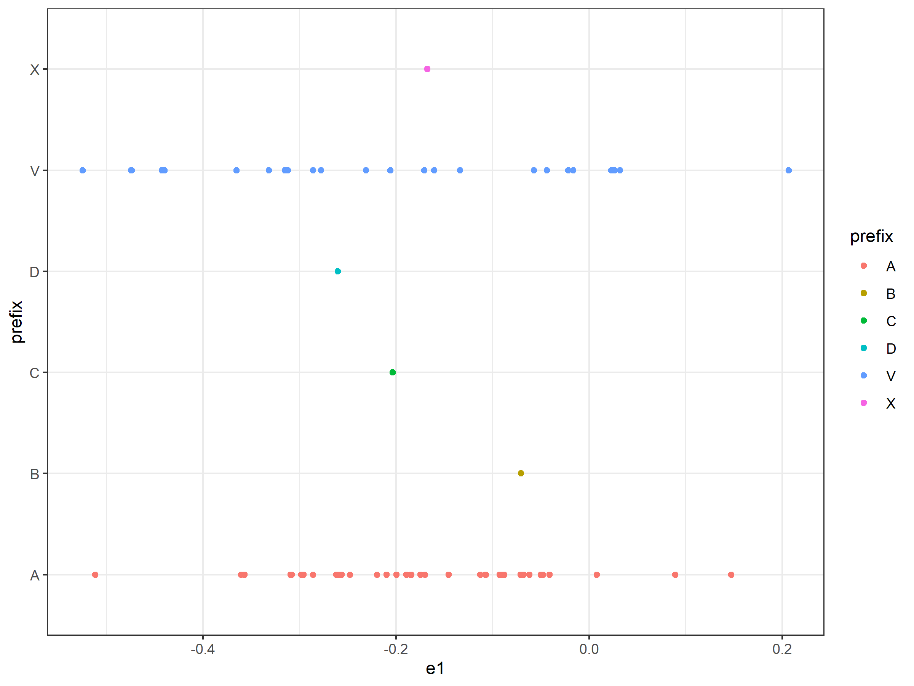
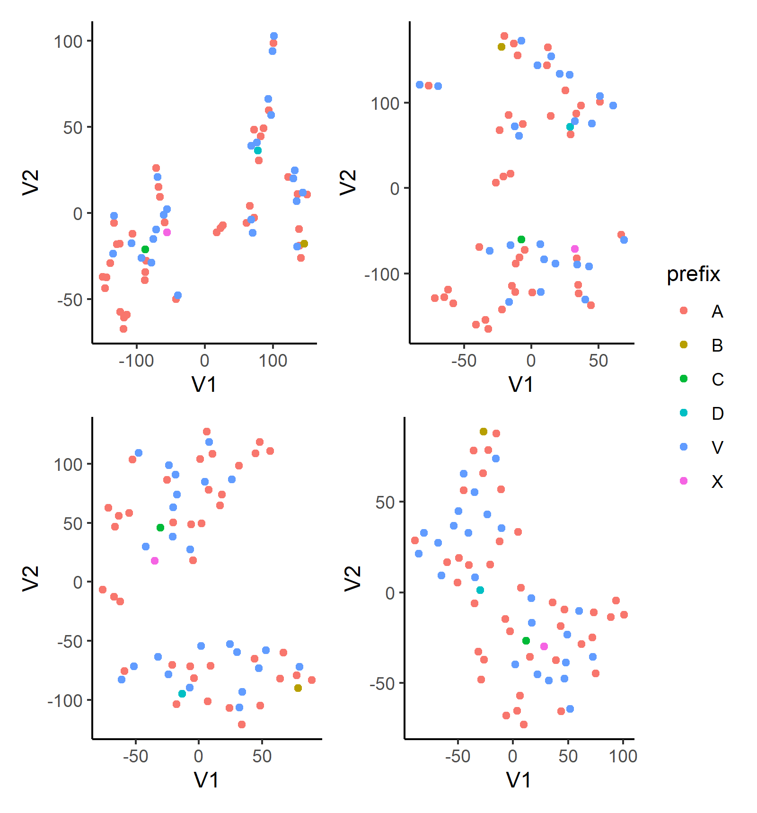

```{r setup, include = FALSE}
knitr::opts_chunk$set(out.extra = "")
```

# Introduction

Categorical data are modelled by actuaries in many different contexts, from pricing of insurance products to reserving 
for the liabilities generated by these products. Sometimes, these data are modelled in an explicit manner, for example, 
when building models that apply across multiple categories, a form of dummy coding is usually used. For example, when 
building models to price the frequency of motor insurance claims, claim experience relating to different types of motor
vehicle will often be modelled by including a (single) factor within models that modifies the relative frequency 
predicted for each type of vehicle. In other cases, modelling is performed for each category separately, thus the 
categorical data is used within the modelling in an implicit manner, for example, common practice is to estimate 
reserves for different lines of business separately, meaning to say, with no parameters being shared across each of the
reserving models.

Recently, several studies of insurance problems have applied an alternative approach, originally from the natural 
known as **categorical embeddings**. Instead of trying to capture the differences between categories using a single 
factor, the categorical embedding approach rather maps each category to a low-dimensional numeric vector, which is then
used within the model as a new predictor variable.

This approach to modelling categorical data has several advantages over more traditional treatments of categorical data.
Using categorical embeddings instead of traditional techniques has been shown to increase predictive accuracy of 
models, for example, see [@Richman2018] in the context of pricing. Models incorporating categorical embeddings can be
pre-calibrated to traditional actuarial models, increasing the speed with which these models can be calibrated and 
leading to models with better explainability [@wuthrich2019yes]. Finally, the similarity between the vectors learned 
for different categories can be inspected, sometimes leading to insights into the workings of models, see, for example,
[@Kuo2019].

On the other hand, several open questions about the use of embeddings within actuarial work remain, which we aim to 
address in this study. First, hyperparameter settings for embeddings, such as the dimensions of the embedding layer and
the use of regularization techniques such as dropout or normalization, that achieve optimal predictive performance has
not yet been studied in detail in the actuarial literature. In this work, we aim to study how embeddings using 
different settings perform in the context of a large-scale predictive modelling problem, and give guidance on the 
process that can be followed to determine this in other problems. Although neural network have been shown to achieve
excellent predictive accuracy on actuarial tasks, many actuaries still prefer to use GLM models for pricing tasks, 
thus, the issue of whether transferring embeddings to GLM models can achieve better performance is considered in this
paper. Traditional actuarial techniques such as credibility theory have been used to work with some types of 
categorical data, but no study has been performed whether this can be applied within embeddings; here, we investigate
whether performance is enhanced by applying credibility theory on embeddings relating to categorical variables with
many labels. Whereas embedding layers are usually considered in the context of categorical data,the option exists to
quantize numerical data and model it using embeddings, however, the results of doing so have not been investigated.
Finally, in the past several years, a new type of neural network architecture based on attention [@Vaswani2017] has
been successfully used on embeddings in the field of natural language processing and we incorporate attention 
based models into our predictive modelling example.

In this work, we utilize the recently released National Flood Insurance Program (NFIP) dataset 
[@FederalEmergencyManagementAgency2019] which provides exposure information for policies written under the NFIP since 
XXXXDateXXXX, as well as the claims data relating to these exposures. We refer the reader to Appendix \ref{NFIP_eda} for
an exploratory analysis of this dataset.

The rest of this manuscript is organized as follows. Section \ref{lit_review} reviews recent applications of embeddings
in the actuarial literature. Section \ref{defns} provides the notation used in the paper and defines GLMs, neural 
networks and related modelling concepts, including embeddings and attention. In Section \ref{modelling}, we provide 
initial models for the NFIP dataset and consider the influence of hyperparameter choices on the results of the neural 
network model. Section \ref{tl} considers how successfully the embeddings used in the neural network model can be 
transferred to a GLM model of the same data. Extensions to the modelling approach are considered in Section \ref{extend} 
and we focus on attention based models in Section \ref{attention}. The interpretability of embedding layers is addressed
in Section \ref{interpretation}. Finally, Section \ref{Conclusions} provides a discussion of the results of this paper
and considers avenues for future research.

# Literature Review {#lit_review}

Categorical data are usually modelled within GLMs and other predictive models using indicator variables which capture 
the effect of each level of the category, see, for example, Section 2 in [@Goldburd], using one of two main encoding 
schemes: dummy-coding and one-hot encoding. Dummy-coding, used in the popular \texttt{R} statistical software, assigns 
one level of the category as a baseline, for which an indicator variable is not calibrated, and the rest of the levels 
are assigned indicator variables, thus, producing estimates within the model of how the effects of each level differ 
from the baselines. One-hot encoding, often used in machine learning, is similar to dummy-coding, but assigns 
indicator variables to each level, in other words, calibrates an extra indicator variable compared with dummy-coding.

A different approach to modelling categorical data is credibility theory (see [@Buhlmann2006] for an overview), which, 
in the context of rating, can be applied to derive premiums that reflect the experience of a particular policyholder, by 
estimating premiums as a weighted average between the premium produced using the collective experience (i.e. of all 
policyholders) and the premium produced using the experience of the particular policyholder. The weight used in this 
average is called a credibility factor and is calculated with reference to te variability of the policyholder experience 
relative to the variability of the group experience. In this context, the implicit categorical variable is the 
policyholder under consideration.

Generalized Linear Mixed Models (GLMMs) are an extension of GLMs that are designed for modelling categorical data using 
a principle very similar to that of credibility theory [@Klinker2010]. Instead of calibrating indicator variables for 
each level of the category, GLMMs estimate effects for each of these levels as a combination of the overall group mean 
and the experience in each level of the category.

Embedding layers represent a different approach to the problem of modelling categorical data that was recently 
introduced in an actuarial context. Note that in the next section, we reflect on similarities between the conventional 
approaches discussed above and embedding layers. [@Richman2018] reviewed the concept of embedding layers and connected 
the sharing of information across categories to the familiar concept of credibility theory. In that work, two 
applications of embedding layers were demonstrated. The first of these was in a Property and Casualty (P&C) pricing 
context, it was shown that the out-of-sample accuracy of a neural network trained to predict claims frequencies on motor 
third party liability was enhanced by modelling the categorical variables within this dataset using embedding layers. 
Second, a neural network with embedding layers was used to model all of the mortality rates in the Human Mortality 
Database, where the differences in population mortality across countries and the differences in mortality at different 
ages were modelled with embedding layers, again producing more accurate out of sample performance than the other models 
tested.

Contemporaneous with that work is the DeepTriangle model of [@Kuo2019], which applied recurrent neural networks to the 
problem of Incurred but not Reported (IBNR) loss reserving, to model jointly the paid and incurred losses in the 
Schedule P dataset. Embedding layers were used to capture the effect of differences in reserving delays and loss ratios 
for each company in the Schedule P dataset. Evaluating the results of the DeepTriangle method showed that the out of 
sample performance of the model (tested against the lower triangles in the Schedule P dataset) exceeded that of 
traditional IBNR reserving techniques.

Many other applications of embeddings have subsequently appeared in the actuarial literature. Within mortality 
forecasting, [@Richman2019d] and [@Richman2020] both apply embeddings layers to model and forecast mortality rates on a 
large scale. [@wuthrich2019yes] discussed how embeddings can be calibrated using GLM techniques and then incorporated 
into a combined actuarial neural network, with subsequent contributions in P&C pricing by [@schelldorfer2019nesting] and 
in IBNR reserving by [@Gabrielli2019c] and [@Gabrielli2019]. Other applications in IBNR reserving are in [@Kuo2020] and 
[@Delong2020a] who use embedding layers to model individual claims development.

# Theoretical Overview {#defns}

In this study, we are concerned with regression modelling, which is the task of predicting an unknown outcome $y$ on the 
basis of information about that outcome contained in predictor variables, or features, stored in a matrix $X$. For 
simplicity, we only consider the case of univariate outcomes, i.e., $y \in \mathbb{R}^1$. The outcomes and the rows of 
the predictor variable matrix are indexed by $i \in \{1 \dots I\}$, where $i$ represents a particular observation of 
$(y_i, \mathbf{x}_i)$, where bold indicates that we are now dealing with a vector. The columns of the predictor 
variables are indexed by $j \in \{1 \dots J\}$, where $j$ represents a particular predictor variable, of which $J$ have 
been observed, thus, we use the notation $X_j$ to represent the $j$th predictor variable and $X \in \mathbb{R}^J$. 
Formally, we look to build regression models that map from the predictor variables $\mathbf{x}_i$ to the outcome $y$ 
using a function $f$ of the form:

$$
\mathbf{f} : \mathbb{R}^J \mapsto \mathbb{R}^1, \quad \quad \mathbf{x_i} \mapsto  \mathbf f{(\mathbf{x_i})} = y. 
$$

In this study, will use mainly use GLMs and neural networks to approximate the function $f(.)$.

The predictor variables that we consider here are comprised of two types: continuous variables, taking on numerical 
values and represented by the matrix $X_{num}$ with $J^{num}$ columns, and categorical variables, which take on 
discrete values indicating one of several possible categories, represented by the matrix $X_{cat}$ with $J^{cat}$ 
columns, such that $J^{num} + J^{cat} = J$.

## Categorical data modeling {#catdata}

A categorical variable $X_j, j \in J_{cat}$ takes as its value only one of a finite number of labels. Let the set of 
labels be $\mathcal{P}^j = \{p^j_1, p^j_2,\dots, p^j_{n_{\mathcal{P}^j}} \}$, where $n_\mathcal{P}^j = |\mathcal{P}^j|$ 
is the cardinality or number of levels, in $\mathcal{P}^j$. One-hot encoding maps each value $x_{i,j}$ of $X_j$ to 
$n_\mathcal{P}^j$ indicator variables, which take a value of $1$ if the label of $x_{i,j}$ corresponds to the level of 
the indicator variable, and $0$ otherwise. An example of one-hot encoding is shown in Table \ref{onehot}.

```{r echo=FALSE, message=FALSE, warning=FALSE, paged.print=TRUE}
require(dplyr)
require(cellar)
require(recipes)
require(data.table)

states <- fread("../manuscript/states.csv")
set.seed(42)
sample_dat <- sample_n(states, 5) %>% arrange(state)

rec <- recipe(~state, data = sample_dat)

dummies <- rec %>% step_dummy(state, one_hot = TRUE)
dummies <- prep(dummies, training = sample_dat)

dummy_data <- bake(dummies, new_data = sample_dat)

cbind(sample_dat, dummy_data) %>%
  knitr::kable(label = "onehot", caption = "Example one-hot encoding of the state variable")
```

One-hot encoding is often used in the machine learning community while the statistical community often favors dummy 
coding, which, instead of assigning $n_p^j$ indicator variables, assigns one of the levels of the categories as a 
baseline, and maps all of the other $n_p^j -1$ variables to indicator variables. An example of dummy encoding is shown 
in Table \ref{dummy}.

```{r, echo=FALSE, message=FALSE, warning=FALSE, paged.print=TRUE}

states <- fread("../manuscript/states.csv")
set.seed(42)

sample_dat <- sample_n(states, 5) %>% arrange(state)

rec <- recipe(~state, data = sample_dat)

dummies <- rec %>% step_dummy(state, one_hot = FALSE)
dummies <- prep(dummies, training = sample_dat)

dummy_data <- bake(dummies, new_data = sample_dat)

cbind(sample_dat, dummy_data) %>%
  knitr::kable(label = "dummy", caption = "Example dummy encoding of the state variable")
```

After encoding the categorical data in this manner, most regression models such as GLMs will then fit coefficients for 
each level of the category in the table (if a tree based model is used, such as decision tree, then splits in the tree 
may occur depending on the presence, or not, of the categorical variable for the data). If one-hot encoding has been 
used, $n_\mathcal{P}^j$ coefficients will be fit, compared to $n_\mathcal{P}^j - 1$ coefficients in the case of dummy 
coding.

These coefficients represent the effect that each level of the categorical variable will have on the outcome. In the 
case that there are no other variables available in the dataset, then the coefficients will reflect the average value of 
the outcomes for that level of the categorical variable. For example, suppose that the categorical variable is a 
policyholder identifier, and the outcomes are the value of claims in different years, then the coefficients will reflect 
the average annual claims for each policyholder based on the experience. In other words, both of these encoding schemes 
give full credibility to the data available for each category, thus, even if a relatively small amount of data is 
available for a specific policyholder, the coefficient that is calibrated will only reflect that data. On the other 
hand, a foundational technique within actuarial work is the application of credibility methods, which are used for 
experience rating and other applications. These techniques provide an estimate that reflects not only the experience of 
the individual policyholder but also that of the collective, based on an estimate of how credible the data for each 
individual is. While we have described the application of credibility in a simple univariate context, it is also 
possible to apply credibility considerations within GLMs. using models known as Generalized Linear Mixed Models or 
GLMMs, and we refer to [@Klinker2010] for more details.

Having described traditional approaches for modeling categorical data, we now turn to neural networks, and discuss 
embedding layers for categorical data modeling, which we define in more detail in the section on neural networks.

## Neural Networks

Neural networks are flexible machine learning models that have recently been applied to a number of problems with 
Property and Casualty (P&C) insurance. Here, we provide a brief overview of these models, and refer the reader to 
[@Richman2018] for a more detailed overview. Neural networks are characterized by multiple layers of non-linear 
regression functions that are used to learn a new representation of the data input to the network that is then used to 
make predictions. Here we focus on the most common type of neural networks, which are fully connected networks (FCNs), 
which provide as the output of each set of non-linear functions to the subsequent layer of functions. Formally, a 
$K$-layer neural network is:

\begin{equation} 
\label{NN}
\begin{split}
z^1 &= \sigma(a_1.X+ b_1) \\
z^2 &= \sigma(a_2.z^1+ b_2) \\
\vdots \\
z^K &= \sigma(a_{K}.z^{K-1}+ b_{K}) \\
\hat{y} &= \sigma(a_{K+1}.z^{K}+ b_{K+1}),
\end{split}
\end{equation}

where the regression parameters (weights) for each layer $$k \in [1;K]$$ are represented by the matrices $a_k$ and the 
intercept terms are represented by $b_k$. Whereas the calculation inside each of the layers is nothing more than linear 
regression, $\sigma$ represents the non-linear part of each layer. Choices for $\sigma$ are often the tanh function or 
the rectified linear unit (ReLu) $max(0,x)$. The parameters of the network are estimated ('trained') as follows. First a 
loss function $L(.,.)$ is specified for the network that measures the difference between the observed data $y$ and the 
predictions of the network $\hat{y}$, for example, the Mean Squared Error ($(y - \hat{y})^2$). Then, the parameters of 
the network are changed such that the loss decreases (formally, this is done using the technique of backpropagation).
Finally, training is stopped once the predictive performance of the network on unseen data is suitably good. 

If $K$ is set equal to $1$, then Equation \ref{NN} reduced to nothing more than a GLM. A neural network with $K=2$ is 
called a shallow neural network and for $K \geq 2$, the network is called a deep neural network. The matrix $X$ of data 
input to the network can be composed of both continuous variables as well as categorical variables, which can be 
pre-processed using one-hot or dummy encoding. As mentioned above, a different option is to use encodings, which we 
discuss in more detail next. 

### Embeddings

Common issues with the traditional encoding schemes for categorical data occur when the number of levels for each 
variable is very large. Often, in these cases, models do not converge quickly, and the very large matrices that result 
from applying these schemes often cause computational difficulties. Besides for these practical issues, a deeper issue 
is that one-hot or dummy encoded data assumes that each category is entirely independent of the rest of the categories, 
in other words, there are no similarities between categories that could enable more robust estimation of models. In 
technical terms, this is because the columns of the matrices created by one-hot encoding are all orthogonal to each 
other. (These arguments appear in a similar form in [@Guo2016].) Solutions to these problems are provided by embedding 
layers. 

An embedding layer is a neural network component which maps each level of the categorical data to a low dimensional 
vector of parameters that is learned together with the rest of the GLM or neural network that is used for the modeling 
problem. Formally, an embedding is

$$
z_\mathcal{P^j} : \mathcal{P^j} \to \mathbb{R}^{q_\mathcal{P^j} }, \quad \quad p^j \mapsto  z_\mathcal{P^j}(p),
$$ 

where $q_\mathcal{P^j}$ is the dimension of the embedding for the $j$th categorical variable and $z_\mathcal{P^j}(.)$ is 
a function that maps from the particular element of the labels $p$ to the embedding space. Equation \ref{eq:embedding} 
states that an embedding maps a level of a categrical variable to a numerical vector. This function is left implicit, 
meaning to say, we allow the embeddings to be derived during the process of fitting the model and do not attempt to 
specify exactly how the embeddings can be derived from the input data. In Table \ref{embed} we show an example of two 
dimensional embeddings for the state variables, where these have been generated randomly.

```{r, echo=FALSE, message=FALSE, warning=FALSE, paged.print=TRUE}
states <- fread("../manuscript/states.csv")
set.seed(42)

sample_dat <- sample_n(states, 5) %>%
  arrange(state)

sample_dat <- sample_n(states, 5) %>%
  arrange(state)


data.frame(sample_dat, dimension1 = rnorm(5), dimension2 = rnorm(5)) %>%
  knitr::kable(label = "", caption = "Example (random) embeddings of the state variable")
```

When applying embeddings in a data modeling context using neural networks, the values of the embeddings will be 
calibrated during the same fitting process that calibrates the parameters of the neural network. The following equation 
shows how the first layer of a neural network incorporating embeddings might be written:

```{=latex}
\begin{equation}
  z^1 = \sigma(a_1.X'+ b_1), 
\end{equation}
```
where we represent the output of embedding layers concatenated together with any numerical inputs as $X'$.

### Attention {#attention}

Attention mechanisms have been widely applied within the deep learning literature to give more flexibility to 
RNNs [@Bahdanau2015a] and subsequently as a replacement for FCNs in the so-called Transformer architecture, which is 
now widely used in natural language processing [@Vaswani2017a], and, more recently, has been applied to computer vision 
and tabular modelling tasks. Attention mechanisms allow deep neural nets to choose covariates entering the model in a 
flexible manner; these types of applications are demonstrated in, for example, [@Vaswani2017a]. In this section we 
provide an introduction to attention mechanisms and then discuss applications of attention to modeling tabular data.

An attention mechanism is a mapping:

```{=latex}
\begin{equation}
A: \mathbb{R}^{q \times (q \times d) \times (q \times d)} \to \mathbb{R}^q, ~~
(\mathbf{q}, K, V) ~\mapsto ~ \mathbf{v} = A(\mathbf{q}, K, V),
\label{eq:attention}
\end{equation}
```

where $\mathbf{q} \in \mathbb{R}^q$ is a query vector, $K \in \mathbb{R}^{q \times d}$ is a matrix of key vectors,
$V \in \mathbb{R}^{q \times d}$ is a matrix of value vectors and $\mathbf{v} \in \mathbb{R}^q$, the output of the 
attention mechanism, is a new vector of values. Several different options for the mapping \eqref{eq:attention} exist in 
the literature; here we first describe the self-attention mechanism used in [@Vaswani2017a]. In more detail, consider 
that $V$ is a matrix of covariates relating to a regression problem, which can be composed of embeddings of the same 
dimension for several categorical variables. We wish to apply the attention mechanism to $V$ to estimate the most 
important of these embeddings for the regression problem. To do this, we formulate the query vector $\mathbf{q}$ which 
contains information about the regression problem at hand; this is usually done by passing $L$ through a FCN. 
Similarly, the matrix $K$ contains the relevance of each row of $L$ for the regression problem and is also usually 
derived by passing each row of $L$ through another FCN. Finally, the matrix $V$ can be set equal to $L$ or 
alternatively, can be derived as a transformation of $L$ using a third FCN. The first step of the attention mechanism 
is to derive a vector $\mathbf{a}$ of attention scores:

```{=latex}
\begin{equation}
\mathbb{R}^{(1 \times q) \times (q \times d)} \to \mathbb{R}^{1 \times d}, ~~
(\bold{q}, K) ~\mapsto ~ \mathbf{a} = \langle \mathbf{q}, K^T \mathbb\rangle.
\label{eq:attention_scores}
\end{equation}
```
The attention scores are then normalized using a soft max function i.e.

```{=latex}
\begin{equation}
a^*_i = \frac{e^{(a_i)}}{\sum_{n=1}^{d} e^{(a_n)}}.
\end{equation}
```
Finally, a linear combination of $V$ is formed:

```{=latex}
\begin{equation}
\mathbb{R}^{(1 \times d) \times (d \times q)} \to \mathbb{R}^{1 \times q}, ~~
(\mathbf{a^*}, V) ~\mapsto ~ \mathbf{v} = \langle \mathbf{a^*}, V \mathbb\rangle.
\label{eq:attention_output}
\end{equation}
```

# Predictive Modeling with Embeddings

In this section, we walk through a simple predictive modeling exercise in order to illustrate the application of 
embeddings. First, we pose a supervised regression problem, based on flood insurance claims severity. We then develop 
GLMs and neural networks utilizing embeddings for this problem, and inspect the trained parameters. Finally, we
provide details of model optimization, inference, and performance.

## Problem Description and Experiment Setup

The working example for our experiments is as follows: Given a set of claim characteristics, we predict the losses paid 
on the property coverage of the policy. The data we use comes from the National Flood Insurance Program (NFIP) and is 
made available by the OpenFEMA initiative 
of the Federal Emergency Management Agency (FEMA)[^9]. Two datasets are made available by OpenFEMA: A policies dataset 
with exposure information, and a claims dataset with claims transactions, including paid amounts. Because there is no 
way to associate records of the two datasets, we are limited to fitting severity models on the claims dataset. While 
the 
complete dataset contains over two million transactions, for the purposes of our experiments we limit ourselves to data 
from 2000 to August 2019, which amounts to approximately 1.4 million claims. The dataset can be downloaded from 
Cellar[^10] The dataset includes a rich variety of variables, from occupancy type to coarse coordinates. For our 
models, 
we work with a few selected variables that represent continuous and discrete variables of low and high cardinalities, 
which we list in Table \@ref(tab:variables)

[^9]: https://www.fema.gov/about/reports-and-data/openfema
[^10]: https://cellar.kasa.ai 

```{r variables, results='asis', message=FALSE, echo = FALSE}
library(magrittr)
variables <- tibble::tribble(
  ~Variable, ~Type,
  "Building insurance coverage", "Numeric",
  "Community Rating System Discount", "Numeric",
  "Basement enclosure type", "Categorical",
  "Occupancy Type", "Categorical",
  "Number of floors in the insured building", "Categorical (binned in original dataset)",
  "Flood zone", "Categorical (high cardinality)",
  "Primary residence", "Categorical (binary indicator)"
)
knitr::kable(
  variables,
  caption = "Predictor variables.",
  booktabs = TRUE,
  table.env = "table",
  escape = FALSE,
  linesep = ""
) %>%
  kableExtra::kable_styling(latex_options = "hold_position")
```

The response variable we take from the dataset is "Amount Paid on Building Claim", which is a numeric variable.

For our experiments, we set up a 10-fold cross validation scheme that is applied to each of the models
we introduce. In Sections \ref{models} and \ref{interpretations}, the tables and figures are based on a single fold of 
the cross validation split. In Section \ref{training-inference}, we provide the cross-validated performance
metrics of each of the models.

We note that the focus of our contribution is on applications of categorical embeddings in predictive modeling, 
rather than
on fine-tuning models in order to beat or establish a benchmark. To this end, we do not perform systematic
hyperparameter tuning in our experiments, and the performance metrics are provided to show that reasonable
models utilizing categorical embeddings. However, as we describe the modeling procedure and results, we provide
commentary on recommended practices in practical applications, especially with respect to the neural network models.

## Models {#models}

In this subsection, we develop the following models:

1. A GLM with gamma distribution and log link function,
2. A neural network with unidimensional categorical embeddings,
3. A GLM with the categorical predictors replaced by the trained embeddings from Model 2,
4. A neural network with multidimensional categorical embeddings.

These model architectures are relatively uncomplicated by today's standards, and are so chosen to better highlight the
embedding components. Later, in Section \ref{attn}, we will investigate more involved architectures utilizing embeddings
that represent the state of the art for modeling tabular data.

### Model 1: GLM 

While this paper focuses on embeddings in neural networks, we begin with a GLM to provide a common frame of 
reference since most actuaries are familiar with the technique. 
Although GLMs are commonplace and well-studied in the actuarial literature, there are still plenty of decisions to 
be made in the modeling process; see, for example, @Goldburd for an in-depth discussion. For our purpose of 
establishing a baseline, we proceed with what we perceive as reasonable decisions around feature engineering and model structure, outlined below:

-   Target variable: Amount paid on building claim
-   Predictors:
    - $\log$ `building_insurance_coverage`
    - `basement_enclosure_type`, 
    - `number_of_floors_in_the_insured_building`
    - *prefix* of `flood_zone`
    - `primary_residence`
-   Link function: $\log$
-   Distribution: gamma

We take the log of the continuous predictor `building_insurance_coverage`, which allows the scale of the predictor to 
match that of the target variable. Because the `flood_zone` variable in the original data contains 60 levels, we take 
the prefix of the zone code, which corresponds to the level of risk as determined by FEMA [^8]. For example, `"A01"`, 
`"A02"`, and so on are recoded as simply `"A"`. A log link together with the gamma distribution is a standard choice 
for severity modeling, which provides a multiplicative structure where the response is positive. Following the notation
in \@ref(catdata), the number of parameters in the GLM is 

\begin{equation}
1 + |J^{\text{num}}| + \left(\sum_{j \in J^{\text{cat}}} n_{\mathcal{P}}^j\right) - |J^{\text{cat}}|:
(\#eq:glm1)
\end{equation}

one for the intercept, one for each numeric variable, and the numbers of levels minus one (due to dummy coding) for 
each categorical variable.

[^8]: https://www.floodsmart.gov/flood-map-zone/find-yours

In Table \@ref(tab:relativities), we exhibit an exerpt of the relativities, or exponentiated fitted coefficients, 
of a couple categorical variables. Recall that the choice of the log link gives a multiplicative structure, so the
interpretation of 1.37 for `occupancy_type = "Non-residential building"` is that, all else equal, the expected 
loss for
a policy for a non-residential building is 1.37 times that of a policy for a single family home, which is the base,
or reference, level for the factor.

Table: (\#tab:relativities) Excerpt of relativities for Model 1.

|variable       |label                                       | relativity|
|:--------------|:-------------------------------------------|----------:|
|occupancy_type |Single family residence                     |       1.00|
|occupancy_type |Non-residential building                    |       1.37|
|occupancy_type |2 to 4 unit residential buidling            |       1.15|
|occupancy_type |Residential building with more than 4 units |       1.64|
|flood_zone     |B                                           |       1.00|
|flood_zone     |A                                           |       0.84|
|flood_zone     |C                                           |       0.60|
|flood_zone     |X                                           |       0.70|
|flood_zone     |V                                           |       0.78|
|flood_zone     |D                                           |       0.89|

### Model 2: Neural Network with Unidimensional Embeddings

For Model 2, we build a feedforward neural network, whose architecture is shown in Figure \@ref(fig:nn-1). 
The categorical inputs go through one-dimensional embedding
layers where they are each mapped to a scalar. The embeddings are then concatenated with the numeric predictors, which
have been normalized in data pre-processing, before being sent to a hidden linear layer of 64 units. A ReLU activation,

\begin{equation}
x \mapsto \max(0, x),
\end{equation}

is then applied to the outputs before they are sent to a final output layer resulting in a scalar. To constrain
predictions to be positive, we apply softplus activation, which is defined to be

\begin{equation}
x \mapsto \log(1 + e^x). 
\end{equation}

```{r nn-1, echo = FALSE, fig.cap = "Architecture of Models 2 and 4.", out.width = "80%", fig.align = "center"}
knitr::include_graphics("images/nn.png")
```

With a single hidden layer, this architecture is the simplest nontrivial neural network; without the hidden layer and
corresponding ReLU activation, we would actually recover a GLM structure where the link function is the output 
activation. 
The choice of one for the embedding dimension is also due to simplicity: it is easily interpretable as the 
representation
of each factor level as a point on the real number line, also, the trained embeddings are easily incorporated into a GLM
which we will see in Model 3. In practice, the embedding dimension is a hyperparameter one can tune, for example via
cross validation, and can vary for each variable. However, we also note that the choice of one for the 
embedding output dimension is not an unreasonable one, especially when the cardinalities of the categorical variables
are not unusually large.

In Tables \@ref(tab:embeddings-occupancy-type) and \@ref(tab:embeddings-flood-zone), we show the learned embeddings
for the `occupancy_type` and an excerpt of them for `flood_zone`. While it may be tempting to compare these values
to those in Table \@ref(tab:relativities), they represent fundamentally different concepts. It is helpful to think
of the embedding values for each variable as a continuous represention of the variable itself, rather than a 
"coefficient" associated with the variable. Note that it is not straightforward to inspect the embeddings from a
table and infer relationships to the response variable, even in a shallow network such as ours, due to nonlinearities
within the model. Also note that we now have a way to incorporate the full granularity of the `flood_zone` variable,
which is why more levels are shown in Table \@ref(tab:embeddings-flood-zone) as compared to Table 
\@ref(tab:relativities). In Section \ref{interpretation}, we will discuss techniques to visualize these embeddings.

Table: (\#tab:embeddings-occupancy-type) Learned embeddings for `occupancy_type`.

|level                                       | embedding|
|:-------------------------------------------|---------:|
|2 to 4 unit residential buidling            |      6.69|
|Non-residential building                    |      7.16|
|Residential building with more than 4 units |      6.33|
|Single family residence                     |      5.43|

Table: (\#tab:embeddings-flood-zone) Excerpt of learned embeddings for `flood_zone`.

|level | embedding|level | embedding|level | embedding|level | embedding|level | embedding|
|:-----|---------:|:-----|---------:|:-----|---------:|:-----|---------:|:-----|---------:|
|A     |      0.38|A09   |     -1.71|A18   |     -1.40|A99   |     -2.68|V     |     -0.41|
|A00   |     -0.35|A0B   |      3.85|A19   |     -1.70|AE    |     -4.46|V02   |      0.65|
|A01   |     -6.76|A10   |     -4.03|A20   |     -4.05|AH    |     -2.35|V03   |     -0.29|
|A02   |     -4.28|A11   |     -5.32|A21   |     -2.08|AHB   |     -1.71|V04   |     -1.15|
|A03   |     -5.93|A12   |     -3.23|A22   |     -2.11|AO    |     -6.07|V05   |     -0.50|
|A04   |     -7.82|A13   |      2.03|A23   |     -1.40|AOB   |     -4.56|V06   |     -1.92|
|A05   |     -3.42|A14   |     -5.72|A24   |      2.23|AR    |     -0.48|V07   |     -2.91|
|A06   |     -4.97|A15   |     -3.67|A25   |      0.28|B     |     -5.36|V08   |     -2.24|
|A07   |     -3.09|A16   |     -3.02|A27   |     -2.56|C     |     -4.47|V09   |     -0.75|
|A08   |     -4.69|A17   |     -0.37|A30   |      1.13|D     |     -0.76|V10   |     -2.05|

### Model 3: GLM with Neural Network Embeddings

For Model 3, we return to the GLM, but now we replace the categorical variables with the trained embeddings from Model
2. In other words, our model now contains only continuous variables, and each categorical factor is represented as a
scalar value and obtains its own coefficient. In contrast with the number of parameters computed in Equation
\@ref(eq:glm1), we have fewer parameters for this model:

\begin{equation}
1 + |J^{\text{num}}| + |J^{\text{cat}}|.
(\#eq:glm2)
\end{equation}

Hence, the model can be written as

\newpage

\begin{equation}
\mu_i = \beta_0 + \sum_{j \in J^{\text{num}}}\beta_{j} x_{i,j} + \sum_{j \in J^{\text{cat}}} \beta_{j} z_{i,j},
\end{equation}

where $z_{i,j}$ represents the embedding value for $i$th instance of the categorical column $X_j$. 

Although in this particular example we incorporate one-dimensional embeddings, one can easily include multidimensional
embeddings, which would increase the model's flexibility. The modeler would need to balance the additional lift with
some loss of interpretability, since with one-dimensional embeddings, our GLM structure dictates that there is a 
monotonic relationship between the predicted response and the input embedding, which could be desirable in certain
use cases (and undesirable in others.)

Since we only have a few parameters in this model, we exhibit the full list of fitted coefficients in Table 
\@ref(tab:glm2).

Table: (\#tab:glm2) Coefficients of Model 3.

|term                                     | estimate|
|:----------------------------------------|--------:|
|(Intercept)                              |    2.389|
|total_building_insurance_coverage        |    0.568|
|basement_enclosure_crawlspace_type       |    0.136|
|number_of_floors_in_the_insured_building |   -0.024|
|occupancy_type                           |    0.067|
|flood_zone                               |    0.035|
|primary_residence                        |   -0.001|
|community_rating_system_discount         |    0.504|


### Model 4: Neural Network with Multidimensional Embeddings

Model 4 is architecturally identical to Model 2, with the only difference being the number of embedding dimensions:
instead of mapping factor levels to real numbers, we map them to points in Euclidean space, where the dimension of the 
space is the ceiling
of the factor's cardinality divided by two. Formally, in the notation of Section \ref{catdata},
$q_{\mathcal{P}^j}=\ceil{n^j_{\mathcal{P}}/2}$ for variable $X_j$. Following the practice from the previous three
models, we list the fitted embeddings for a couple variables in Tables \@ref(tab:nn2-occupancy-type) and 
\@ref(tab:nn2-flood-zone). Note that, for `flood_zone`, we are
only displaying the embedding for *one* level.

Table: (\#tab:nn2-occupancy-type) Learned embeddings for `occupancy_type` in Model 4.

|level                                       |    e1|    e2|   e3|
|:-------------------------------------------|-----:|-----:|----:|
|2 to 4 unit residential buidling            | -1.44| -1.97| 2.35|
|Non-residential building                    | -6.83| -8.11| 5.34|
|Residential building with more than 4 units | -7.63| -6.58| 5.09|
|Single family residence                     | -1.61| -2.54| 3.01|

Table: (\#tab:nn2-flood-zone) Learned embeddings for level `"A00"` of variable `flood_zone` in Model 4.

|dimension |value  |dimension |value  |dimension |value  |dimension |value  |
|:---------|:------|:---------|:------|:---------|:------|:---------|:------|
|e1        |0.020  |e11       |2.146  |e21       |-1.933 |e31       |-0.941 |
|e2        |-0.885 |e12       |1.723  |e22       |1.150  |e32       |-1.279 |
|e3        |-0.126 |e13       |0.378  |e23       |0.863  |e33       |-0.360 |
|e4        |1.491  |e14       |-0.310 |e24       |-0.471 |e34       |-1.173 |
|e5        |0.980  |e15       |2.482  |e25       |0.929  |          |       |
|e6        |0.952  |e16       |1.823  |e26       |-1.139 |          |       |
|e7        |-0.217 |e17       |-2.715 |e27       |0.113  |          |       |
|e8        |-0.611 |e18       |1.144  |e28       |1.155  |          |       |
|e9        |0.919  |e19       |-0.045 |e29       |0.707  |          |       |
|e10       |-1.196 |e20       |0.467  |e30       |1.358  |          |       |

## Visualization Techniques for Interpretation {#interpretation}

With AI and ML coming into the mainstream across industries and use cases, the topic of model explainability
has received increasing attention. In insurance pricing, @kuo2020explainability propose a framework for
model interpretability in the context of regulation and actuarial standards of practice, while @henckaerts2020boosting
investigate algorithm-specific techniques to inspect tree-based models. @kuo2020explainability and references
therein also discuss
commonly utilized model-agnostic explanation techniques, such as permutation variable importance and partial
dependence plots, that can be applied to the neural networks we consider in this paper.

In this section, we focus on ways to visualize the learned embeddings. In the authors' experiences, oftentimes
the formats of the visualizations --- basic line and scatter plots --- even more so than the content of the data, is 
helpful in explaining the concept to stakeholders.

For Model 2, the neural network with one-dimensional embeddings, the task is simple: we can simply plot the levels
on a line, as in Figure \@ref(fig:num-floors). In the case of `flood_zone`, since we happen to have the luxury of knowing a
priori the meaning of the prefixes, we can plot them separately, as in Figure \@ref(fig:flood-zone) to see how the model 
mapped them.

```{r num-floors, echo=FALSE, fig.cap="Number of floors", out.width = "80%", fig.align="center"}
knitr::include_graphics("images/num_floors.png")
```

```{r flood-zone, echo = FALSE, fig.cap="Flood zone embeddings", out.width = "60%", fig.align = "center"}

```

For Model 4, the neural network with multi-dimensional embeddings, we would need to treat the learned values before
we can plot them. Specifically, we need to reduce the dimension of the data to 2D for embeddings with more than
two dimensions. The standard approachs for this are principal component analysis (PCA; @shlens2014tutorial) 
and t-distributed stochastic
neighbor embedding (t-SNE; @Maaten2008a), both of which we illustrate.

### Principal Component Analysis

In both approaches, the overarching theme is as follows: We have a collection of points in higher dimensional space,
$\mathcal{X} = \{x_1, x_2, \dots, x_n\}$ that we wish to map to some lower dimensional space, typically $\mathbb{R}^2$,
obtaining $\mathcal{Y} = \{y_1, y_2, \dots, y_n\}$. PCA performs a linear change of coordinates on 
the input data so that the variance of the data is maximized along each orthogonal coordinate, also known as
*principal component*, successively. Formally, if we denote $\mathbf{X}$ and $\mathbf{Y}$ to be the matrices whose 
columns are elements of 
$\mathcal{X}$ and $\mathcal{Y}$, respectively, this can be represented as looking for an orthonormal matrix $\mathbf{P}$
in $\mathbf{Y} = \mathbf{PX}$ such that the covariance matrix of $\mathbf{Y}$, $\frac{1}{n}\mathbf{YY^T}$, is diagonal.
Here, the rows of $\mathbf{P}$ are the principal components that define the resulting coordinate system. It turns out
that that these principal components are the eigenvectors of the covariance matrix of $\mathbf{X}$, i.e., 
$\mathbf{C_X} \equiv \frac{1}{n}\mathbf{XX^T}$. In practice, numerical procedures, including R's \texttt{prcomp()}
which we use, utilize singular value decomposition (SVD) to compute the eigenvectors.

In Figure \@ref(fig:flood-zone-pca), we plot the learned embeddings for `flood_zone` in Model 3 on the coordinate
system defined by the first two principle components. (TODO: add commentary after update pic)

```{r flood-zone-pca, echo = FALSE, fig.cap="Flood zone PCA", out.width = "60%", fig.align = "center"}
knitr::include_graphics("images/flood_zone_pca.png")
```

### t-Distributed Stochastic Neighbor Embedding

In contrast with PCA, t-SNE is a nonlinear technique. At a high level, it computes a similarity metric, in the form of
conditional probabilities based on pairwise distances, among points in $\mathcal{X}$, then look for points $\mathcal{Y}$
in the lower dimensional space which have similarity metric values (for a differently defined metric) that are "close" to those of corresponding pairs of 
points in the original data.

Let $p_{j|i}$ denote the probability that point $x_i$ picks point $x_j$ as its *neighbor*, if it picks neighbors in
proportion to their density under an $n$-dimension Gaussian centered at $x_i$. Formally, we can write $p_{j|i}$ as

\begin{equation}
p_{j|i} = \frac{\exp(\norm{x_i - x_j}^2 / 2\sigma_i^2)}{\sum_{k\neq i} \exp(-\norm{x_i - x_k}^2 / 2\sigma_i^2)}. (\#eq:pji)
\end{equation}

The similarity metric for the originals space symmetrizes this conditional probability and is defined as

\begin{equation}
p_{ij} = \frac{p_{j|i} + p_{i|j}}{2n}.
\end{equation}

On the other hand, in the target space, t-SNE assumes the neighbor selection is driven by a Student 
t-distribution with one
degree of freedom, i.e., a Cauchy distribution. The similarity metric for a pair of points in $\mathcal{Y}$ is 
then defined as the joint probability

\begin{equation}
q_{ij} = \frac{(1 + \norm{y_i - y_j}^2)^{-1}}{\sum_{k \neq l} (1 + \norm{y_k - y_l}^2)^{-1}}.
\end{equation}

With the similarity metrics defined for each space, we can then state the objective for "closeness" for the sets of
points, which is the Kullback–Leibler divergence from Q to P:

\begin{equation}
D_{KL}(P || Q) = \sum_{i \neq j} p_{ij} \log \frac{p_{ij}}{q_{ij}}. (\#eq:tsne-obj)
\end{equation}

We now circle back to Equation \@ref(eq:pji) and discuss $\sigma_i$. The variance of the Gaussian is allowed to vary
depending on where the point is in the space; specifically, it should reflect the density or sparsness of surrounding 
points. To train this parameter, t-SNE introduces a hyperparameter, *perplexity*, which is a scalar value set by the
user, and is defined as

\begin{equation}
Perp(P_i) = 2^{H(P_i)},
\end{equation}

where $H(P_i)$ denotes the entropy of $P_i$,

\begin{equation}
H(P_i) = -\sum_j p_{j|i}\log_2 p_{j|i},
\end{equation}

and $P_i$ is the Gaussian parameterized by $x_i$ and $\sigma_i$. During training, t-SNE looks for $P_i$ that have
perpelxity corresponding to the user input. Finally, the objective as stated in Equation \@ref(eq:tsne-obj) is differentiable, and is trained via gradient descent. 

While t-SNE is a powerful visualization technique, there are a few points the modeler should be mindful of in practice.
First, the resulting plot can be very sensitive to the perplexity hyperparameter. 
In Figures \@ref(fig:flood-zone-tsne), we display the t-SNE of the learned embeddings for `flood_zone` in
Model 3 with various perplexity settings. (TODO: add more commentary).

```{r flood-zone-tsne, echo = FALSE, fig.cap="Flood zone t-SNE", out.width = "60%", fig.align = "center"}

```

## Training and Inference {#training-inference}

For the GLMs, Models 1 and 3, we follow the standard optimization procedure using iteratively reweighted least 
squares (IWLS) without regularization. For the neural networks, Models 2 and 4, we utilize the \texttt{Adam}
optimizer [@Kingma2014] with a learning rate of TODO, and train the each network for TODO epochs with a batch
size of TODO.

During inference, or scoring, care must be taken to accommodate the categorical levels that are unseen
during training. While we allow for an extra key in the embedding dictionary (TODO: mention this earlier), the initial
weights are not updated during training, which could lead to nonsensical predictions in the validation or test sets. To
circumvent this issue, before applying the trained model but after the final optimization epoch, we update the weights
for the unseen levels manually. In practice, a common approach is to take an average value 
of some sort of the weights of theother levels. In our case, we take the median (if there are multiple, the lower of
the two), but a mean, mean weighted by frequency of observations, or trimmed mean could be used.

In Table TODO, we exhibit the cross-validated performance metrics of each of the models.

# Extending the model {#extend}

Investigate approaches for using embedding layers for numeric variables, or numeric variables that were captured as 
categorical variables (Can the modelling of numerical variables benefit from the application of embedding layers?) How 
should this best be done? CatBoost - cut into 256 groups smoothness Map numeric to a dense layer and use that as 
embedding - basis expansion Add a distribution to the embeddings Can insights from credibility theory lead to enhanced embeddings? Take credibility mixture over embeddings Cluster embeddings PCA of embeddings

# Attention based modelling {#attn}

Can we get some lift by adding attention layers? TabNet model Transformer model

Description of tabnet, talk about how it's related to embeddings, show some plots 
like \@ref(fig:masks) etc.

```{r masks, echo = FALSE, fig.cap = "blahblah", out.width = "100%", fig.align = "center"}
knitr::include_graphics("images/masks.png")
```

# Conclusions {#Conclusions}

Conclusions

\newpage

# References {.unnumbered}
